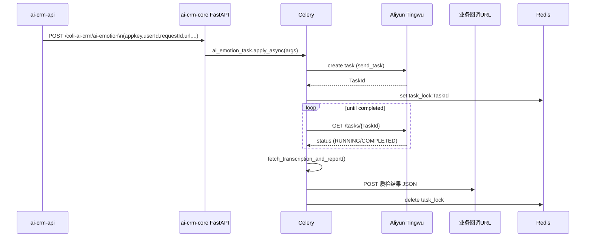
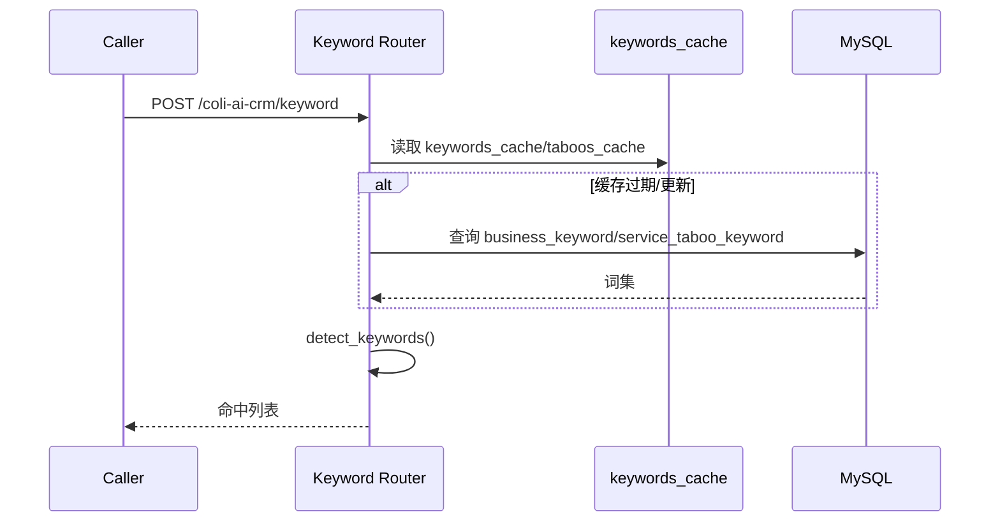
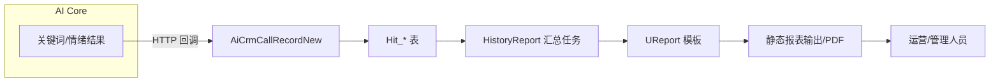

# AI CRM 详细设计文档

## 1. 范围
本详细设计覆盖 AI CRM 的核心业务流与接口，包括：
1. 语音录音 AI 质检（情绪/转写/报告）
2. 关键词/忌语检测
3. 标准话术质检（LLM）
4. 静态化报表及运营闭环

内容包含时序说明、请求/响应契约以及关键实现要点。

## 2. 用例一：语音录音 AI 质检

### 2.1 流程概述
- 触发源：`ai-crm-api` 在接收新的 `crm_call_record_new` 数据后，调用 `ai-crm-core` 的 `/coli-ai-crm/ai-emotion`。
- 核心服务：FastAPI 路由 `transcription_emotion.py`、Celery 任务 `tasks.ai_emotion_task`、阿里云听悟 API。
- 结果：录音转写文本、情绪标签、服务质检 JSON，通过回调写入 `AiCrmCallRecordNew` 及关联表。

### 2.2 时序图


### 2.3 接口契约
| 接口 | 方向 | 描述 |
| --- | --- | --- |
| `POST /coli-ai-crm/ai-emotion` | API → Core | 触发离线语音质检。请求体参见 `SpeechRequest`（包含录音 URL、开/结语列表、回调地址、时长），需在 Header 中携带 `appkey`，并通过 `signature_required` 校验。 |
| `Callback URL` | Core → API/外部 | 由调用方提供。`tasks.py` 将结构化结果（转写文本、情绪编码、摘要、资源链接）POST 回调。失败时写 log 并重试。 |
| `Aliyun Tingwu` | Core → 云服务 | `send_task` 创建任务；`down_task` 轮询 `/openapi/tingwu/v2/tasks/{id}` 获取 `Transcription/Summarization/ServiceInspection` URL。 |

### 2.4 关键实现
- `transcription_emotion.py` 负责参数校验、Logger 上下文绑定、自定义异常。
- `tasks.py` 中的 `create_http_session` + `RequestsRetry` 提升并发稳定性；`task_lock:{id}` 防止重复处理。
- 结果 JSON 结构：
  ```json
  {
    "success": true,
    "resultCode": 200,
    "data": {
      "transcription": "...",
      "emotionRecog": {"客户情绪": "1", "坐席情绪": "2"},
      "summarize": "标题：...\n总结概要：...",
      "transcription_url": "...",
      "service_inspection_url": "..."
    }
  }
  ```

## 3. 用例二：关键词/忌语检测

### 3.1 流程
1. `ai-crm-core` 启动时调用 `initialize_keyword_cache()`，每 30 秒后台刷新 MySQL 中的词库。
2. `ai-crm-api` 或第三方以 `POST /coli-ai-crm/keyword` 请求，对转写文本进行同步检测。
3. `keyword_inspect.detect_keywords` 会拆分 `坐席/客户` 角色，匹配业务关键词与服务忌语，返回命中句段。
4. 结果写入 `hit_business_keyword_info`、`hit_taboo_word_info` 表，同时在 API 层触发告警或报表聚合。

### 3.2 时序图


### 3.3 接口契约
| 字段 | 说明 |
| --- | --- |
| `userId` | 调用来源 ID |
| `requestId` | 幂等跟踪 ID |
| `transcription` | 原始对话文本，支持“坐席/客户”标签 |

响应 `data.keyword/taboos` 为数组，元素包含 `key/value/count`，便于 API 层写库。

### 3.4 关键实现
- 自建 `DatabaseConnectionPool`（`pymysql` + `Queue`）降低连接成本。
- `asyncio` + `cache_lock` 防止并发读写冲突。
- `extract_sentences`/`extract_text_with_limit` 提供命中上下文，方便 UReport 展示。

## 4. 用例三：标准话术质检

### 4.1 流程
1. 调用 `POST /coli-ai-crm/standard-script`（路由定义在 `standard_script.py`）传入 ServiceInspection URL、脚本关键词、响应规则。
2. 服务并行获取转写内容与 service inspection JSON，基于场景关键词/时间窗口切片对话。
3. 通过 `llm.llm_caller`、`llm_start_end_detect` 调用 LLM 完成语义判断，输出布尔结果与上下文片段。
4. 结果在 API 层落库 (`standard_script_scene`, `hit_standard_script_info` 等 Mapper) 并驱动人工复核流程。

### 4.2 核心算法
- `scene_analysis`：按照 `script_keywords` 定位段落，结合 `before_seconds_ms/after_seconds_ms` 控制上下文宽度，再对每个 `response_rule` 触发 LLM。
- `detect_phrases_from_start_paragraph` / `detect_phrases_from_end_paragraph`：用于开场/结束语语义检测，引入 `llm_start_end_detect`.
- `extract_json`：对 LLM 返回值做 JSON 解析与容错。

### 4.3 接口要点
| 参数 | 描述 |
| --- | --- |
| `service_inspection_url` | 听悟返回的质检 JSON |
| `transcription_url` | 对话转写 JSON |
| `script_keywords` | 场景关键字 + 角色 |
| `response_rules` | 业务校验规则（通常来自 `standard_phrase_models`） |
| `judgment_method` | few-shots 或规则型识别方式 |

## 5. 用例四：静态化报表与运营闭环

### 5.1 流程
1. `module.ext` 中的定时任务（Spring Task）汇总命中数据写入 `history_report`。
2. `UReportConfig` 暴露 `/ureport/*`，由运营人员在控制台选择模板和数据源。
3. 报表生成后写入 `sys_file`/`history_report`，并通过 `WebSocket` 或 `SysTask` 通知。

### 5.2 数据通路


### 5.3 关键实现
- `UReportConfig` 加载 `ureport-console-context.xml` 与 `ureport.properties`，注册 Servlet。
- `HistoryReportService` 结合 `HistoryReportMapper` 输出多维指标（项目、团队、关键词、忌语、情绪）。
- 报表权限依赖 `SysRoleMapper` 和 `SysPowerMapper`，通过数据权限注解限制可见范围。

## 6. 公共接口与安全
- 所有 FastAPI 接口在 `tools.signator.signature_required` 装饰器下校验 `sign`、`timestamp`、`nonce`，避免重放。
- `tools.logger.set_logger_context` 将 `userId/requestId` 写入 MDC，便于链路追踪。
- `ai-crm-api` 层的 REST 接口通过 `sa-token` + 数据权限注解保护，外部回调由白名单 IP + Token 控制。
- 错误处理统一输出 `{success,resultCode,resultMsg}` 结构，并在 `ExtLogMapper` 记录请求。

## 7. 配置与可运维性
- 配置文件：`application-*.yaml`, `config_*.yml`。部署时通过 ConfigMap/Secret 下发。
- 监控：`/health` 返回 CPU/内存/缓存项，`monitor_health.py` 可作为探针。Celery 使用 `celery_tasks.log` + Prometheus Exporter（可扩展）。
- 灰度：通过 API 与 Core 部署在独立 Deployment，上层 API Gateway 可按租户或项目路由到不同版本。

本详细设计可与 `docs/overall-design.md`、`docs/diagrams/*.svg` 联动，用于评审与开发联调。

